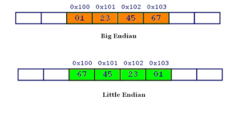

# ByteArray

ByteArray 类提供用于优化读取、写入以及处理二进制数据的方法和属性。

注意：ByteArray 类适用于需要在字节层访问数据的高级开发人员。

## Endian, EndianConst

Endian类中包含一些值，它们表示用于表示多字节数字的字节顺序。

字节顺序为bigEndian（最高有效字节位于最前）或littleEndian（最低有效字节位于最前）。

```tsx
export class Endian {
  //表示多字节数字的最低有效字节位于字节序列的最前面。
  public static LITTLE_ENDIAN: string = "littleEndian";
  //表示多字节数字的最高有效字节位于字节序列的最前面。
  public static BIG_ENDIAN: string = "bigEndian";
}

export const enum EndianConst {
  LITTLE_ENDIAN = 0,
  BIG_ENDIAN = 1
}
```

什么叫字节序呢？

计算机硬件有两种储存数据的方式：大端字节序（big endian）和小端字节序（little endian）。

1. 大端字节序：高位字节在前，低位字节在后，符合人类读写数值的规则。
2. 小端字节序：低位字节在前，高位字节在后



为什么会有小端字节序呢？统一用大端字节序不可以吗？

答案是，计算机电路先处理低位字节，效率比较高，因为计算都是从低位开始的。所以，计算机的内部处理都是小端字节序。

但是，人类还是习惯读写大端字节序。所以，除了计算机的内部处理，其他的场合几乎都是大端字节序，比如网络传输和文件储存。

## ByteArray类

首先介绍一下 ByteArray 类中几个重要的私有变量。

1. data: DataView  是用于读写二进制数据的视图
2. _bytes: Uint8Array 是二进制流
3. _position: number 是当前指针的位置
4. write_position: number 是已经使用的字节偏移量，那么 **write_position - _position 就是可读的剩余字节数。**
5. $endian: EndianConst 是大小端字节序的标记
6. bufferExtSize: number 是Buffer扩展大小

首先看一下ByteArray的构造函数。

```tsx
constructor(buffer?: ArrayBuffer | Uint8Array, bufferExtSize = 0) {
  if (bufferExtSize < 0) {
    bufferExtSize = 0;
  }
  this.bufferExtSize = bufferExtSize;
  let bytes: Uint8Array, wpos = 0;

  if (buffer) {//有数据，则可写字节数从字节尾开始
    let uint8: Uint8Array;
    if (buffer instanceof Uint8Array) {
      uint8 = buffer;
      wpos = buffer.length;
    } else {
      wpos = buffer.byteLength;
      uint8 = new Uint8Array(buffer);
    }
    //根据长度创建一个Uint8Array
    if (bufferExtSize == 0) {
      bytes = new Uint8Array(wpos);
    } else {
      let multi = (wpos / bufferExtSize | 0) + 1;
      bytes = new Uint8Array(multi * bufferExtSize);
    }
    //把数据流放入到其中
    bytes.set(uint8);
  } else {
    //没有数据的，新建一个即可
    bytes = new Uint8Array(bufferExtSize);
  }
  this.write_position = wpos;
  this._position = 0;
  this._bytes = bytes;
  this.data = new DataView(bytes.buffer);
  this.endian = Endian.BIG_ENDIAN; //大端字节序
}
```

```tsx
//判断读写len长度的字节是否有效
public validate(len: number): boolean {
  let bl = this._bytes.length;
  if (bl > 0 && this._position + len <= bl) {
    return true;
  } 
  return false;
}
```

从字节流中读出一个 boolean 值，那么首先就要判断再读一个字节时，是否没有超出文件尾，未超出的话，那么就从字节流中读出一字节，并且让 _position 移动一字节。

从字节流中读出其他的 bytes, short, int float, double，都是如此，先判断是否读写某个长度的字节时，是否还在字节流合理的范围内。若还在，那就可以从字节流中读取了，并且让文件指针的位置(_position)移动相应的长度。

readUnsignedByte 和 readBoolean 都是从 **this._bytes** 中读的，剩余其他的读的方法都是在 this.data 中读出。

---

在这些读字节流的方法中，主要说说读 UTF-8 字符串的方法。因为字节流都是二进制的，所以是需要编码转码才能转换为字符串。

首先我们需要读取一位无符号的16位整数，介于0~65535之间。这个16位整数，是我们在写入字符串时写入的，用于标记字符串的长度。

```tsx
//从字节流中读取一个 UTF-8 字符串。假定字符串的前缀是无符号的短整型（以字节表示长度）
//返回UTF-8编码的字符串
public readUTF(): string {
  let length = this.readUnsignedShort();
  if (length > 0) {
    return this.readUTFBytes(length);
  } else {
    return "";
  }
}

//从字节流中读取一个由 length 参数指定的 UTF-8 字节序列，并返回一个字符串
//由指定长度的 UTF-8 字节组成的字符串
public readUTFBytes(length: number): string {
  if (!this.validate(length)) {
    return;
  }
  let data = this.data;
  //读出length长度的字节流
  let bytes = new Uint8Array(data.buffer, data.byteOffset + this._position, length);
  this.position += length;
  //由上面的字节流编码转码返回的字符串
  return this.decodeUTF8(bytes);
}
```

下面两个方法，就是从字节流中读写UTF-8字符串的。（重点学习内容）

```tsx
private encodeUTF8(str: string): Uint8Array {}

private decodeUTF8(data: Uint8Array): string {}
```

在 encodeUTF8 方法中，其调用了另一个方法 **stringToCodePoints ,** 此方法的意思就是把字符串转变为 Unicode 编码。记住 UTF-8 是Unicode的一种实现方式。

对于上面的两个方法，我们既可以采用egret的实现方式，也可以使用HTML5提供的 **TextDecoder** 和 **TextEncoder** 类。只要加载egret的核心库后，重写上面的两个方法即可。

```tsx
    let prototype: any;
    prototype = egret.ByteArray.prototype;
    prototype.decodeUTF8 = function (data: Uint8Array) {
        return new TextDecoder().decode(data);
    };
    prototype.encodeUTF8 = function (str: string) {
        return new TextEncoder().encode(str);
    };
```

**注意：二进制操作字符串，对于我现阶段来说，有点糊涂，但还是要去学习的。当一个读源码的提升自己的机会。**

**参考：**

ASCII 和 Unicode 关系：

[http://www.ruanyifeng.com/blog/2007/10/ascii_unicode_and_utf-8.html](http://www.ruanyifeng.com/blog/2007/10/ascii_unicode_and_utf-8.html)

stringToCodePoints ：

[WebIDL Level 1](http://www.w3.org/TR/WebIDL/#idl-DOMString)

字节序：

[理解字节序](http://www.ruanyifeng.com/blog/2016/11/byte-order.html)
