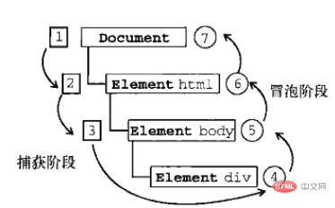

# Event

> Event 类作为创建事件实例的基类，当发生事件时，Event 实例将作为参数传递给事件侦听器。Event 类的属性包含有关事件的基本信息，例如事件的类型或者是否可以取消事件的默认行为。对于许多事件（如由 Event 类常量表示的事件），此基本信息就足够了。但其他事件可能需要更详细的信息。例如，与触摸关联的事件需要包括有关触摸事件的位置信息。您可以通过扩展 Event 类（TouchEvent 类执行的操作）将此类其他信息传递给事件侦听器。Egret API 为需要其他信息的常见事件定义多个 Event 子类。与每个 Event 子类关联的事件将在每个类的文档中加以介绍。Event 类的方法可以在事件侦听器函数中使用以影响事件对象的行为。
>
> 某些事件有关联的默认行为，通过调用 preventDefault() 方法，您的事件侦听器可以取消此行为。可以通过调用 stopPropagation() 或 stopImmediatePropagation() 方法，将当前事件侦听器作为处理事件的最后一个事件侦听器。

在 Event 类中定义了多个常量，主要是抛出监听的事件类型。类型是区分大小写。

```tsx
//在将显示对象直接添加到舞台显示列表或将包含显示对象的子树添加至舞台显示列表中时调度。
public static ADDED_TO_STAGE: string = "addedToStage";
//在从显示列表中直接删除显示对象或删除包含显示对象的子树时调度。
public static REMOVED_FROM_STAGE: string = "removedFromStage";
//将显示对象添加到显示列表中时调度。
public static ADDED: string = "added";
//将要从显示列表中删除显示对象时调度。
public static REMOVED: string = "removed";
//[广播事件] 进入新的一帧,监听此事件将会在下一帧开始时触发一次回调。这是一个广播事件，可以在任何一个显示对象上监听，无论它是否在显示列表中。
public static ENTER_FRAME: string = "enterFrame";
//渲染事件，监听此事件将会在本帧末即将开始渲染的前一刻触发回调，这是一个广播事件，可以在任何一个显示对象上监听，无论它是否在显示列表中。
//注意：每次您希望 Egret 发送 Event.RENDER 事件时，都必须调用 stage.invalidate() 方法，由于每帧只会触发一次屏幕刷新，若在 Event.RENDER 回调函数执行期间再次调用stage.invalidate()，将会被忽略。
public static RENDER: string = "render";
//舞台尺寸或UI组件尺寸发生改变
public static RESIZE: string = "resize";
//属性值或状态发生改变。通常是按钮的选中状态，或者列表的选中项索引改变。
public static CHANGE: string = "change";
//属性值或状态即将发生改变,通常是按钮的选中状态，或者列表的选中项索引改变。可以通过调用 preventDefault() 方法阻止索引发生更改。
public static CHANGING: string = "changing";
//网络请求加载完成
public static COMPLETE: string = "complete";
//循环完成。循环最后一次只派发 COMPLETE 事件，不派发 LOOP_COMPLETE 事件。
public static LOOP_COMPLETE: string = "loopComplete";
//TextInput实例获得焦点
public static FOCUS_IN: string = "focusIn";
//TextInput实例失去焦点
public static FOCUS_OUT: string = "focusOut";
//动画声音等播放完成
public static ENDED: string = "ended";
//游戏激活
public static ACTIVATE: string = "activate";
//取消激活
public static DEACTIVATE: string = "deactivate";
//Event.CLOSE 常量定义 close 事件对象的 type 属性的值。
public static CLOSE: string = "close";
//Event.CONNECT 常量定义 connect 事件对象的 type 属性的值。
public static CONNECT: string = "connect";
//Event.LEAVE_STAGE 常量定义 leaveStage 事件对象的 type 属性的值。
public static LEAVE_STAGE: string = "leaveStage";
//Event.SOUND_COMPLETE 常量定义 在声音完成播放后调度。
public static SOUND_COMPLETE: string = "soundComplete";
```

## Event.create

从对象池中取出或创建一个新的事件实例。我们建议您尽可能使用Event.create()和Event.release() 这一对方法来创建和释放事件对象，这一对方法会将事件实例在内部缓存下来供下次循环使用，减少对象的创建次数,从而获得更高的代码运行性能。

注意：若使用此方法来创建自定义事件的实例，自定义的构造函数参数列表必须跟Event类一致。也就是说传入的 EventClass 是 Event 类或者其子类。

```tsx
public static create<T extends Event>(EventClass: { new(type: string, bubbles?: boolean, cancelable?: boolean): T; eventPool?: Event[] },
            type: string, bubbles?: boolean, cancelable?: boolean): T {
            let eventPool: Event[];
            let hasEventPool = (EventClass as any).hasOwnProperty("eventPool");
            if (hasEventPool) {
                eventPool = EventClass.eventPool;
            }

            if (!eventPool) {
                eventPool = EventClass.eventPool = [];
            }
            if (eventPool.length) {
                let event: T = <T>eventPool.pop();
                event.$type = type;
                event.$bubbles = !!bubbles;
                event.$cancelable = !!cancelable;
                event.$isDefaultPrevented = false;
                event.$isPropagationStopped = false;
                event.$isPropagationImmediateStopped = false;
                event.$eventPhase = EventPhase.AT_TARGET;
                return event;
            }
            return new EventClass(type, bubbles, cancelable);
}
```

## Event.release

释放一个事件对象，并缓存到对象池。

注意：此方法只能传入由Event.create()创建的事件实例，传入非法对象实例可能会导致报错。

```tsx
public static release(event: Event): void {
            event.clean();
            let EventClass: any = Object.getPrototypeOf(event).constructor;
            EventClass.eventPool.push(event);
}
```

## const enum EventPhase

EventPhase 可为 Event 类的 eventPhase 属性提供值。其有三个值，分别对应事件流的三个阶段。

1. CAPTURING_PHASE = 1 捕获阶段  =》事件从Document节点自上而下向目标节点传播的阶段；
2. AT_TARGET = 2 目标阶段，是事件流的第二个阶段 =》真正的目标节点正在处理事件的阶段；
3. BUBBLING_PHASE = 3 冒泡阶段 =》事件从目标节点自上而下向Document节点传播的阶段。


