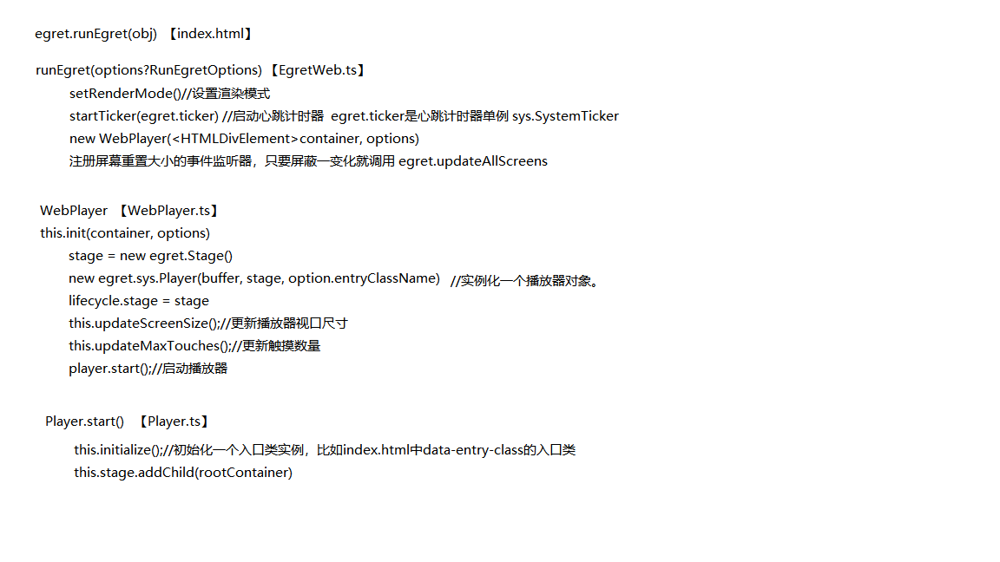
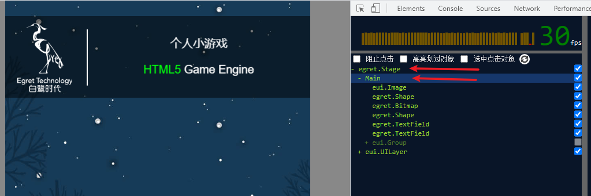

# 开始游戏流程

## index.html文件

开始加载游戏时，是加载根目录下的 index.html 文件。

在index.html文件里，有一个顶级的 div 组件，这就是我们游戏的界面。

```HTML
<div style="margin: auto;width: 100%;height: 100%;" 
     class="egret-player"
     data-entry-class="Main"
     data-orientation="{{=it.orientationMode}}"
     data-scale-mode="{{=it.scaleMode}}"
     data-frame-rate="{{=it.frameRate}}"
     data-content-width="{{=it.contentWidth}}"
     data-content-height="{{=it.contentHeight}}"
     data-multi-fingered="2"
     data-show-fps="false"
     data-show-log="false"
     data-show-fps-style="x:0,y:0,size:12,textColor:0xffffff,bgAlpha:0.9">
</div>
```

这个div的属性介绍如下：

- style: 这个div的根式
- class: div的class name
- data-entry-class: egret游戏的入口类
- data-orientation: 屏幕方向
- data-scale-mode: 屏幕适配模式
- data-frame-rate: 游戏运行的帧率
- data-content-width: 初始内容宽度
- data-content-height: 初始内容高度
- data-multi-fingered: ？？最大触屏数量 maxTouches
- data-show-fps: 是否显示FPS
- data-show-log: 是否显示日志
- data-show-fps-style: 显示FPS的窗口样式

在index.html文件中还有一段javascript代码，其功能就是加载 manifest.json 文件，并把其中配置的 js 文件加载到浏览器中。等 manifest.json 中的全部 js 文件加载完毕，开始运行 egret.runEgret，开始游戏创建和加载。

```js
//egret工程入口函数
egret.runEgret({
  renderMode: "webgl", 
  audioType: 0, 
  calculateCanvasScaleFactor: function (context) {
    var backingStore = context.backingStorePixelRatio ||
  context.webkitBackingStorePixelRatio ||
  context.mozBackingStorePixelRatio ||
  context.msBackingStorePixelRatio ||
  context.oBackingStorePixelRatio ||
  context.backingStorePixelRatio || 1;
    return (window.devicePixelRatio || 1) / backingStore;
    },
  pro: false//是否启动3d环境
});
```

## egret.runEgret

在这个函数里，有两种创建WebPlayer的方式，一种是Egret Native，另一种是H5。我们主要看的是H5模式的。

在H5模式中，首先设置一些html5兼容性配置，在 Html5Capatibility 类中。

设置渲染模式（"auto","webgl","canvas"）

设置canvas的Scale

启动心跳计时器。startTicker(egret.ticker)

```tsx
function startTicker(ticker: egret.sys.SystemTicker): void {
//使用浏览器默认的定时器
  let requestAnimationFrame =
    window["requestAnimationFrame"] ||
    window["webkitRequestAnimationFrame"] ||
    window["mozRequestAnimationFrame"] ||
    window["oRequestAnimationFrame"] ||
    window["msRequestAnimationFrame"];

//若不存在，则自定义
  if (!requestAnimationFrame) {
    requestAnimationFrame = function (callback) {
      return window.setTimeout(callback, 1000 / 60);
    };
  }

  requestAnimationFrame(onTick);

  function onTick(): void {
    requestAnimationFrame(onTick);//每1000/60毫秒调用一次
    ticker.update();//执行一次刷新
  }
}
```

创建屏幕适配器实例 egret.sys.screenAdapter

```tsx
if (options.screenAdapter) {
  egret.sys.screenAdapter = options.screenAdapter;
} else if (!egret.sys.screenAdapter) {
  egret.sys.screenAdapter = new egret.sys.DefaultScreenAdapter();
}
```

创建WebPlayer

```tsx
let list = document.querySelectorAll(".egret-player");
let length = list.length;
for (let i = 0; i < length; i++) {
let container = <HTMLDivElement>list[i];
let player = new WebPlayer(container, options);//创建webplayer
container["egret-player"] = player;//重写egret-player的DIV
}
```

监听window对象的resize，如果窗口大小有变化，那么就延时300毫秒刷新屏幕显示

```tsx
let resizeTimer: number = NaN;
function doResize() {
  resizeTimer = NaN;
  egret.updateAllScreens();
}
window.addEventListener("resize", function () {
  if (isNaN(resizeTimer)) {
    resizeTimer = window.setTimeout(doResize, 300);
  }
});

//刷新所有Egret播放器的显示区域尺寸。仅当使用外部JavaScript代码动态修改了Egret容器大小时，需要手动调用此方法刷新显示区域。
//当网页尺寸发生改变时此方法会自动被调用。(监听了window的resize属性)
function updateAllScreens(): void {
  if (!isRunning) {
    return;
  }
  let containerList = document.querySelectorAll(".egret-player");
  let length = containerList.length;
  for (let i = 0; i < length; i++) {
    let container = containerList[i];
    let player = <WebPlayer>container["egret-player"];
    player.updateScreenSize();
  }
}
```

## WebPlayer.ts

新建一个WebPlayer播放器，把index.html中的div，以及创建参数传递给它。

```tsx
let list = document.querySelectorAll(".egret-player");
  let length = list.length;
  for (let i = 0; i < length; i++) {
    let container = <HTMLDivElement>list[i];
    let player = new WebPlayer(container, options);
    container["egret-player"] = player;
}
```

在WebPlayer类的构造函数中，主要做两个操作，一个是初始化，一个是监听屏幕旋转。

在初始化中，会做以下几个操作：

- 创建egret.Stage，并将其赋值给egret的生命周期的stage
- 添加canvas到容器中（传入的div）
- 实例化一个Web触摸对象 new WebTouchHandler(stage, canvas)
- 创建Egret播放器 egret.sys.Player
- 实例化HTMLInput
- 更新播放器视口尺寸
- 更新触摸数量
- 启动Egret播放器

---



## Player.ts

在实例化 egret.sys.Player 时只传入一些必要的参数，实例化后如果需要显示FPS或日志的，调用其 displayFPS 方法处理。最后再开始启动播放器。

在启动播放器时，根据传入的参数（index.html的data-entry-class属性）找到入口类的完整类名（比如Main.ts）并实例化，然后将其添加到舞台Stage中。

至此，在浏览器中我们就能看到对应的Stage舞台和Main类中的各种组件所组成的页面了。

```tsx
public start(): void {
  if (this.isPlaying || !this.stage) {
    return;
  }
  $TempStage = $TempStage || this.stage;
  this.isPlaying = true;
  if (!this.root) {
    this.initialize();
  }
  ticker.$addPlayer(this);//添加到心跳计时器单例中
}

private initialize(): void {
  let rootClass;
  if (this.entryClassName) {
    rootClass = egret.getDefinitionByName(this.entryClassName);
  }
  if (rootClass) {
    let rootContainer: any = new rootClass();//实例化
    this.root = rootContainer;
    if (rootContainer instanceof egret.DisplayObject) {
      this.stage.addChild(rootContainer);
    } else {
      DEBUG && $error(1002, this.entryClassName);//Egret入口类 {0} 必须继承自egret.DisplayObject。
    }
  } else {
    DEBUG && $error(1001, this.entryClassName);//找不到Egret入口类: {0}。
  }
}
```

在我们实例化入口类（Main）时，在其构造函数中，我们可添加一些监听事件，比如 **egret.Event.ADDED_TO_STAGE** 。

在把入口类实例添加到舞台时，会抛出对应的事件 egret.Event.ADDED_TO_STAGE。



### 参考

[Using requestAnimationFrame](https://css-tricks.com/using-requestanimationframe/)

[Paul Irish](https://www.paulirish.com/2011/requestanimationframe-for-smart-animating/)

[egret-labs/egret-core](https://github.com/egret-labs/egret-core/blob/master/src/egret/web/WebPlayer.ts)

[egret-labs/egret-core](https://github.com/egret-labs/egret-core/blob/master/src/egret/player/Player.ts)
