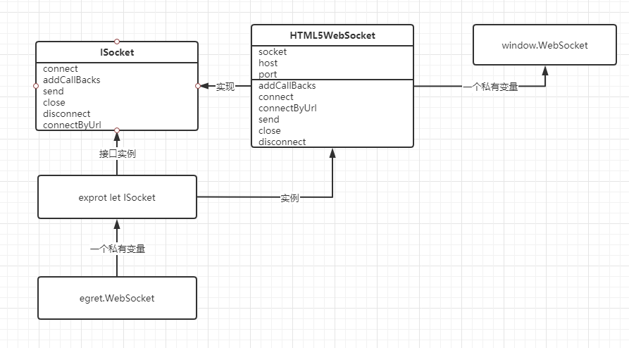
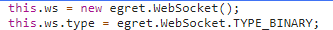
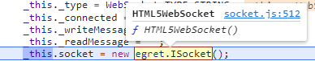
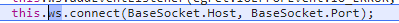
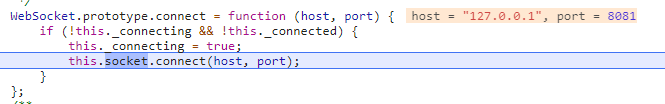
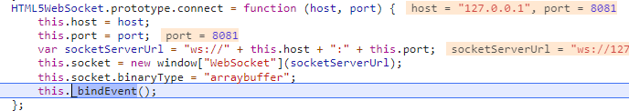

# websocket

websocket是全双工的通信方式，既可以客户端主动发送信息，也可以服务端主动发送信息回来。很符合游戏的需求。

## ISocket.ts

首先有一个 **interface ISocket ，**其中定义了一些基本的方法。并且导出了一个全局的变量 ISocket。

```tsx
exprot interface ISocket {}
export let ISocket:{new():ISocket};
```

## HTML5WebSocket.ts

HTML5WebSocket 继承于接口 ISocket ，并且最后会把 HTML5WebSocket 赋值给上面定义的全局变量 ISocket 上。HTML5WebSocket 在 egret.web 命名空间下。

```tsx
ISocket = HTML5WebSocket
```

在HTML5WebSocket中有一个 socket 的私有变量，这个 socekt 是 window.WebSocket 的实例，且这个 socekt 的 binaryType = "arraybuffer"。也就是传输方式是二进制方式。

```tsx
this.socket = new window["WebSocket"](socketServerUrl);
this.socket.binaryType = "arraybuffer";
```

window.WebSocket 是 HTML5 底层提供的，不需要再深入这一部分了，以后有机会有能力的再深入学习底层的实现。

## WebSocket.ts

egret引擎自己实现了一个 Websocket ，其没有继承上面写的 ISocket 接口和 HTML5WebSocket 类。其继承是的 egret.EventDispatcher，此类是 Egret 的事件派发器类，负责进行事件的发送和侦听。（后面再研究 EventDispatcher 源码）

WebSocket 中有一个私有变量 socket ，其主要是 new egret.ISocket 出来的。

```tsx
private socket: ISocket;

this.socket = new egret.ISocket();
```

由于 ISocket 和 HTML5WebSocket 以及 window.Websocket 的关系，所以 WebSocket 的私有变量 socket 指向 HTML5WebSocket，而 HTML5WebSocket 的私有变量 socket 又指向 window.WebSocket。

WebSocket类是封装类，主要还是封装一些读写数据流的方法，便于客户端操作罢了，其与后端交互的底层还是 window.WebSocket。



寻找流畅：在 egret.WebSocket.connect 或者 egret.WebSocket.send 方法中，一步一步的断点进去，就能从 egret.WebSocket 到 HTML5WebSocket，然后再到 window.webSocket 了。

---

断点调试：

先 new egret.WebSocket，



断点进入 new egret.WebSocket，此时你可以看到 egret.ISocket 已经是 HTML5WebSocket 了，在 egret.WebSocket 中会有一个 socket ，其指向 egret.ISocket，即 HTML5WebSocket 。



创建了 egret.WebSocket 后，接下来调用 connect 方法进行连接，一步一步断点进去。在 egret.Websocket 的 connect 中，其是调用内部的 socket (HTML5WebSocket) 的connect方法。再断点进入，在 HTML5WebSocket 的 connect 方法内，其拼接了一个websocket地址，然后再 new window.WebSocket。







所以说白鹭引擎封装的 egret.Websocket  的底层，依旧是 HTML5 中的 WebSocket。
